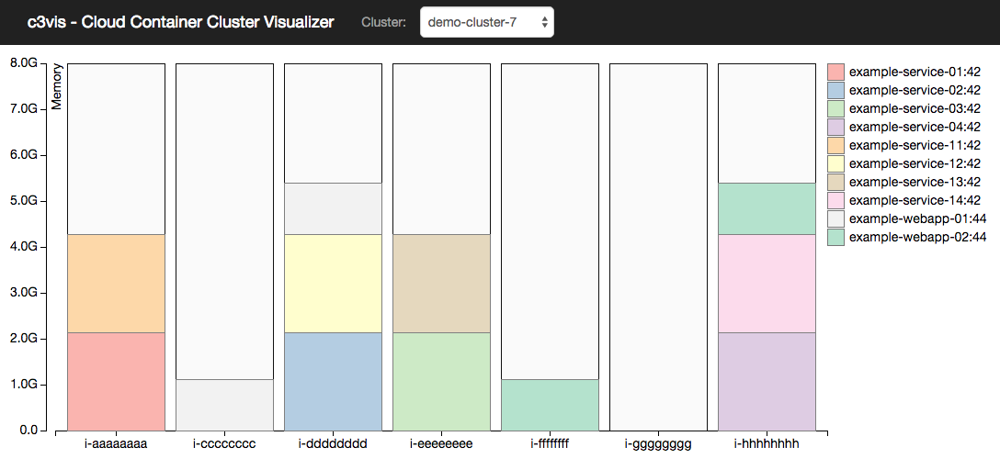

# c3vis - Cloud Container Cluster Visualizer

Helps visualize the resource utilisation of Amazon ECS clusters.

Deploying software as “containers” promises to solve many problems with regards to interoperability of environments, speed to deploy, and cost reduction.
But understanding where our software lives now becomes more difficult both for development and operations teams.
This is due to the fact that it is quite laborious to find the information indicating where the software is now located and the quantity of resources still available for more software.
Several ECS console screens must be viewed, and the amount of time required to process this information grows with the amount of software deployed.
 
The Cloud Container Cluster Visualizer (c3vis) aims to give administrators and teams one place to gain rapid insight into the state of where the containers are running and the capacity available for more containers.



The visualization displays the EC2 instances in the selected cluster as vertical bars.  The Tasks allocated to the instances are represented as stacked boxes indicating their reserved memory.
Each unique Task Definition is represented as a different color, with the legend showing the Task Family name and revision number.
Each Task will contain one or more containers, the task box shows accumulated reserved memory for all containers in the Task. ECS Services are not currently represented.

### Limitations

Cluster visualisation is currently limited to displaying up to the first 100 instances in a cluster. It represents reserved memory only.


## Configure

Displaying live ECS data requires server-side AWS credentials.

### Region

Before running, add a file named ```aws_config.json``` to this project root directory.  At a minimum set the default region:

```
{
  "region": "<default-region>"
}
```

Alternatively, set the environment variable "AWS_REGION" before starting the server.

### Credentials

AWS credentials properties "accessKeyId" and "secretAccessKey" can be added to the aws_config.json file as per https://docs.aws.amazon.com/AWSJavaScriptSDK/guide/node-configuring.html.

Otherwise, the credentials will be loaded from the Shared Credentials File or Environment Variables or IAM roles if deployed to an AWS instance.

When using an IAM role, ensure the role has the following access:

* ecs.listContainerInstances
* ecs.describeContainerInstances
* ecs.listTasks
* ecs.describeTasks
* ecs.describeTaskDefinition
* ecs.listClusters
* ec2.describeInstances

**WARNING:** c3vis makes ECS data from the above API calls (including environment variables in task definitions) available to clients/browsers.
Ensure the c3vis server is available only to users that should have access to this information.


## Requirements

Node >= 0.12

## Building and Running

Server is based on ExpressJS. Client uses D3.js.

Run the following to build and run the server ("package.json" contains instructions to pre-install required node modules):

```
npm start
```

This will run ```npm install``` and ```node --harmony ./bin/www```
(NOTE: ```"--harmony"``` is required for ES6 functionality such as Array.find())

Now browse to the app at `http://localhost:3000`.

### Usage

When a client browser first connects to the c3vis server the Cluster dropdown will be populated with ECS cluster names for the configured region.

Select from the dropdown to view the resources allocated to that cluster. If no cluster names appear in the dropdown, check the server logs and ensure the correct region is configured (see below).

The list of clusters and the user's current selection are stored in cookies. Use the ```[refresh list]``` dropdown entry to refresh the list of clusters.

The Y axis shows total memory available for the instances.

The X axis displays the Private IP Address for each EC2 instance. Right-clicking the IP address shows the context menu with links to browse the instance in the ECS and EC2 consoles.

### Sample Clusters for Testing

From the browser, use a ```"?static=true"``` query parameter to have the server return static test data. Useful for testing when server is unable to connect to AWS.

Browse to `http://localhost:3000/?static=true`.

### Debugging

Add the following line to server-side Javascript code to add a breakpoint:

```
debugger;
```

then run the debugger with:

```
node debug --harmony ./bin/www
```

### Running with Docker

Build and tag the image:

```
docker build -t c3vis .
```

Run the container: (can remove ```AWS_ACCESS_KEY_ID``` and ```AWS_SECRET_ACCESS_KEY``` if deployed somewhere with appropriate IAM access)

```
docker run -e "AWS_REGION=<region> AWS_ACCESS_KEY_ID=<accesskey>" -e "AWS_SECRET_ACCESS_KEY=<secretkey>" -p 3000:3000 c3vis
```


Browse to `<docker localhost>:3000` (e.g. [http://192.168.99.100:3000](http://192.168.99.100:3000))


# Credits

Created by [Matt Callanan](https://github.com/mattcallanan) with thanks to internal Expedia reviewers for their suggestions and advice.


# Legal

This project is available under the [Apache 2.0 License](http://www.apache.org/licenses/LICENSE-2.0.html).

Copyright 2015 Expedia Inc.
