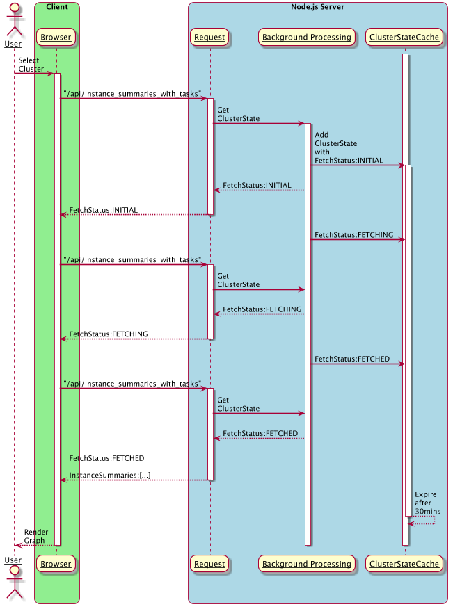
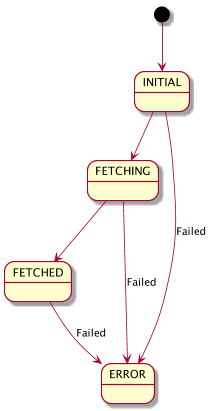
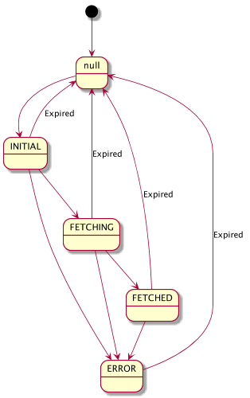

# c3vis Request Handling & Caching

## Short Polling for `instance_summaries_with_tasks` API

The following diagram depicts the interaction between the client and server  
when retrieving cluster data.
 
When a client first asks the server for instances and tasks for a cluster (or
 on the first request after cluster state has expired), the server will:
1. Create a `ClusterState` object with `FetchStatus` = `INITIAL`
2. Store it in the in-memory `ClusterStateCache`
3. Return `INITIAL` to client
4. Proceed to process the request in the background ("Background Processing" swimlane)
5. Background: Populate the cached `ClusterState` object with cluster data
6. Background: Update the `ClusterState` object's `FetchStatus`
7. Return current state to client

Client will poll the server until it finds `INITIAL` or `ERROR` state.

### Force Refresh

If the user clicks "Refresh Server Cache", the client will send a 
`forceRefresh=true` parameter on its first polling attempt.  The server upon 
seeing `forceRefresh=true` will  invalidate the cached `ClusterState` entry 
and begin the above process again.
 
## Fetch Status State Diagram

Fetch Status State|Description
------------------|-----------
INITIAL|State object created
FETCHING|Server has begun fetching cluster data asynchronously
FETCHED|Server has completed fetching cluster data
ERROR|Server encountered an error fetching cluster data

## Cluster State Cache Expiry and Fetch Status

When a ClusterState object is added to the in-memory cache,
it is set to expire within `clusterStateCacheTtl` milliseconds.
The default being 30mins.  After that time, the cache object is 
set to `null` and won't be set to `INITIAL` until necessitated by 
a subsequent client request.

